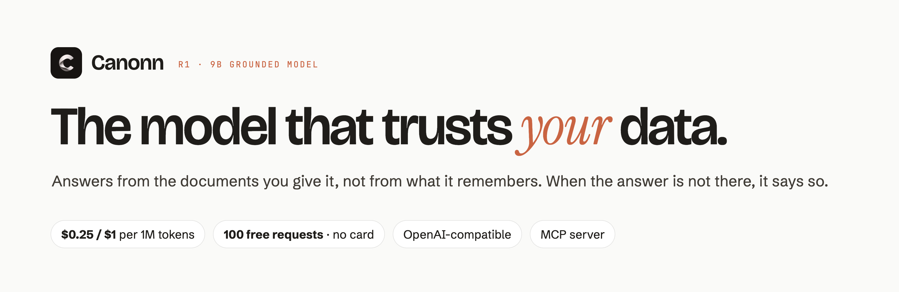
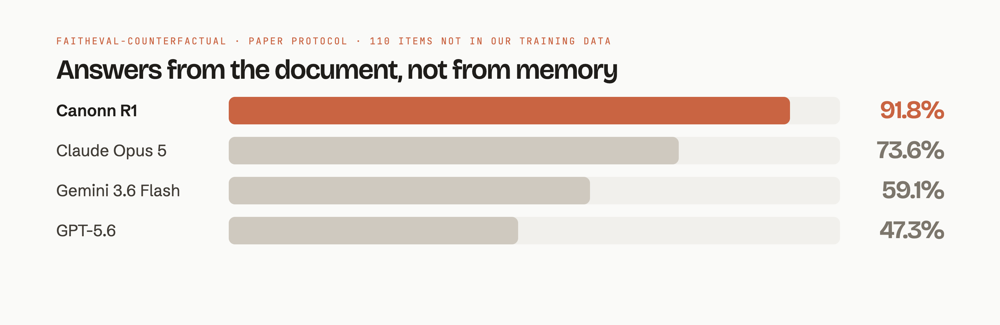

<p align="center">
  <picture>
    <source media="(prefers-color-scheme: dark)" srcset=".github/assets/banner-dark.png">
    
  </picture>
</p>

<p align="center">
  <a href="https://canonn.ai"><b>Website</b></a> ·
  <a href="https://canonn.ai/docs/"><b>Docs</b></a> ·
  <a href="https://canonn.ai/benchmark/"><b>Benchmark</b></a> ·
  <a href="https://canonn.ai/mcp/"><b>MCP</b></a> ·
  <a href="https://canonn.ai/dashboard/"><b>Get an API key</b></a>
</p>

<p align="center">
  <a href="https://canonn.ai/docs/"></a>
  
  
  
  <a href="LICENSE"></a>
</p>

---

**Canonn R1** is a 9B model trained for one job: answer from the documents you give it. General-purpose models often "correct" your documents from what they remember; Canonn follows the page. When the answer is not in your data it says so, and when two of your documents disagree it says that too and quotes both.

It is served as an OpenAI-compatible API, so existing code works with a new base URL and model name.

## Quickstart

```bash
pip install openai
export CANONN_API_KEY=...   # free key, 100 requests, no card: https://canonn.ai/dashboard/
```

```python
import os
from openai import OpenAI

client = OpenAI(base_url="https://api.canonn.ai/v1", api_key=os.environ["CANONN_API_KEY"])

reply = client.chat.completions.create(
    model="canonn-r1",
    messages=[
        {"role": "system", "content": "Answer from this document.\n\nReturns are accepted within 30 days of delivery."},
        {"role": "user", "content": "Can I return an order after six weeks?"},
    ],
)
print(reply.choices[0].message.content)
# No. Returns are accepted within 30 days of delivery, and six weeks is past that.
```

<details>
<summary><b>Node</b></summary>

```js
import OpenAI from 'openai';

const client = new OpenAI({ baseURL: 'https://api.canonn.ai/v1', apiKey: process.env.CANONN_API_KEY });
const reply = await client.chat.completions.create({
  model: 'canonn-r1',
  messages: [
    { role: 'system', content: 'Answer from this document.\n\nReturns are accepted within 30 days of delivery.' },
    { role: 'user', content: 'Can I return an order after six weeks?' },
  ],
});
console.log(reply.choices[0].message.content);
```
</details>

<details>
<summary><b>curl</b></summary>

```bash
curl https://api.canonn.ai/v1/chat/completions \
  -H "Authorization: Bearer $CANONN_API_KEY" \
  -H "Content-Type: application/json" \
  -d '{"model": "canonn-r1", "messages": [
        {"role": "system", "content": "Answer from this document.\n\nReturns are accepted within 30 days of delivery."},
        {"role": "user", "content": "Can I return an order after six weeks?"}]}'
```
</details>

## Benchmarks

<picture>
  <source media="(prefers-color-scheme: dark)" srcset=".github/assets/benchmark-dark.png">
  
</picture>

| Measurement | Canonn R1 | Comparison |
|---|---|---|
| FaithEval-counterfactual, paper's prompt and scorer, 110 items not in our training data | **91.8%** | Claude Opus 5 73.6% · Gemini 3.6 Flash 59.1% · GPT-5.6 47.3% |
| Six public Zendesk help centres, 201 answerable questions, core answer correct | **185** | Claude Sonnet 5: 189 |
| Cost of that help-centre run | **$0.19** | Claude Sonnet 5: $2.60 |
| Instructions planted inside documents, 160 attacks, resisted | **158** | GPT-5.6: 87 |

Methods, dates and the cases where we do not lead (Claude Sonnet 5 is ahead on strict accuracy; a 9B model is not the fastest you can call) are on [canonn.ai/benchmark](https://canonn.ai/benchmark/).

## Examples

| Example | What it shows |
|---|---|
| [`examples/python/quickstart.py`](examples/python/quickstart.py) | Answer a question from your own document |
| [`examples/python/stream.py`](examples/python/stream.py) | Stream the answer token by token |
| [`examples/node/quickstart.mjs`](examples/node/quickstart.mjs) | The same from Node |
| [`examples/invoice-agent`](examples/invoice-agent) | A payables agent: 50 invoices checked against their contracts, mismatches held with both sentences quoted |

## Use it from your coding agent

Canonn runs as an MCP server, so Claude Code, Codex and OpenCode can call it when a task depends on your documents.

```bash
claude mcp add --transport http canonn https://canonn.ai/mcp --header "Authorization: Bearer $CANONN_API_KEY"
```

Codex and OpenCode setup: [canonn.ai/mcp](https://canonn.ai/mcp/).

## API at a glance

| | |
|---|---|
| Base URL | `https://api.canonn.ai/v1` |
| Model | `canonn-r1` |
| Price | $0.25 / 1M input tokens · $1 / 1M output tokens |
| Free tier | 100 requests on signup, no card |
| Limits | 16,384-token context · 4,096-token output · 120 requests per minute per key |
| Spec | [`openapi.yaml`](openapi.yaml) |
| Data | not used for training · request logging off by default · served from Canada |

## License

The examples in this repository are MIT licensed. Use of the API is governed by the [Canonn terms](https://canonn.ai/legal/#terms).
